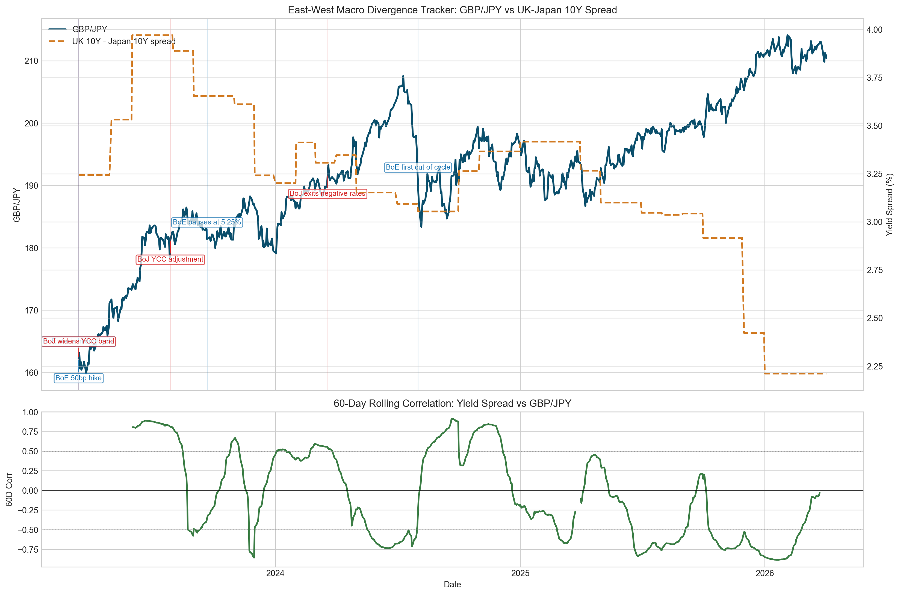

# FX Monitor

FX Monitor now combines two complementary workflows: a live FX volatility monitor for short-term moves and an East-West Macro Divergence Tracker focused on GBP/JPY, UK 10-year gilt yields, and Japan 10-year government bond yields. The macro project is built to show how monetary-policy divergence between the Bank of England and the Bank of Japan feeds through into rates differentials, capital flows, and the GBP/JPY exchange rate.


## Project structure

- `fx_monitor/live_monitor.py`: real-time FX volatility monitoring with Alpha Vantage spot prices.
- `fx_monitor/data_sources.py`: Alpha Vantage FX history plus UK/Japan 10Y yield pulls via `yfinance`, with `fredapi` fallback when Yahoo yield tickers break or go stale.
- `fx_monitor/macro_analysis.py`: data alignment, forward-filling, spread calculation, rolling correlation, and narrative summary generation.
- `fx_monitor/events.py`: major Bank of England and Bank of Japan decision dates used for chart annotations.
- `fx_monitor/plotting.py`: dual-axis macro chart and rolling-correlation subplot.
- `fx_monitor/main.py`: command-line entrypoint for both workflows.

## Macro tracker workflow

1. Pull daily GBP/JPY closes from Alpha Vantage using the `FX_DAILY` endpoint.
2. Pull UK and Japan 10Y yields from Yahoo Finance first (`GB10Y=RR`, `JP10Y=RR`), then fall back to FRED if the Yahoo series are stale or unavailable.
3. Merge the three time series on the date index, reindex to business days, and forward-fill gaps caused by country-specific market holidays.
4. Compute the UK-Japan 10Y spread and the rolling correlation between the spread and GBP/JPY.
5. Plot GBP/JPY against the yield spread on dual axes and annotate major BoE and BoJ policy decisions directly on the price chart.

## Usage

Install dependencies:

```bash
pip install -r requirements.txt
```

Set environment variables in `.env`:

```bash
API_KEY=your_alpha_vantage_key
FRED_API_KEY=your_fred_key  # optional; public FRED CSV fallback also works
```

Run the macro tracker:

```bash
python -m fx_monitor.main macro --start-date 2021-01-01 --end-date 2026-04-06 --window 60
```

Run the live volatility monitor:

```bash
python -m fx_monitor.main live
```

## Outputs

- `outputs/gbpjpy_macro_divergence.csv`: merged dataset with FX, yields, spread, and rolling correlation.
- `outputs/gbpjpy_macro_divergence.png`: chart with dual axes, rolling correlation, and central-bank annotations.



## Key finding

Between 2023-03-13 and 2026-04-03, GBP/JPY rose 29.7% while the UK-Japan 10Y yield spread ended at 2.21 percentage points. Over the same sample, the 60-day rolling correlation between the spread and GBP/JPY averaged -0.07; the latest valid reading was -0.03 on 2026-03-24, it peaked at 0.91 on 2024-09-20, and fell to -0.88 on 2026-01-21. In plain English, that is broadly consistent with the idea that wider UK-Japan rate differentials can support sterling against the yen, but it also shows the relationship is regimedependent and can break down when the spread proxy flattens or when other macro forces dominate the cross.

